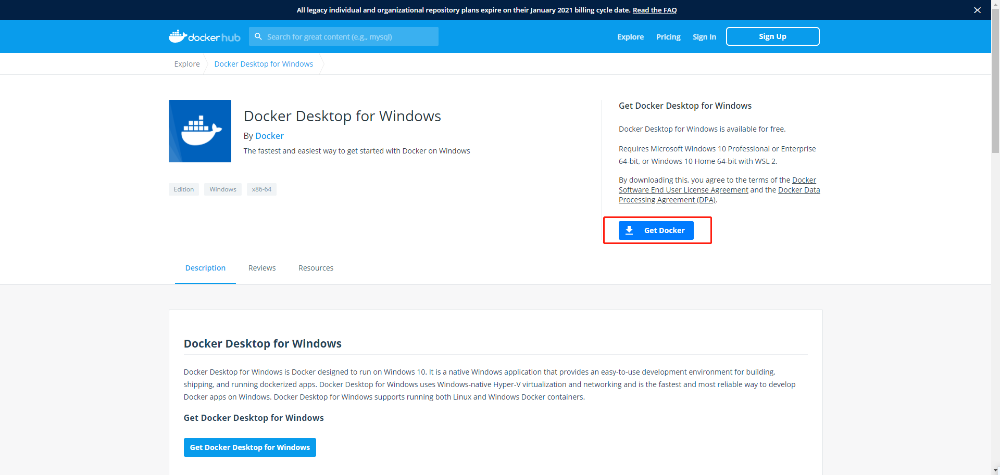
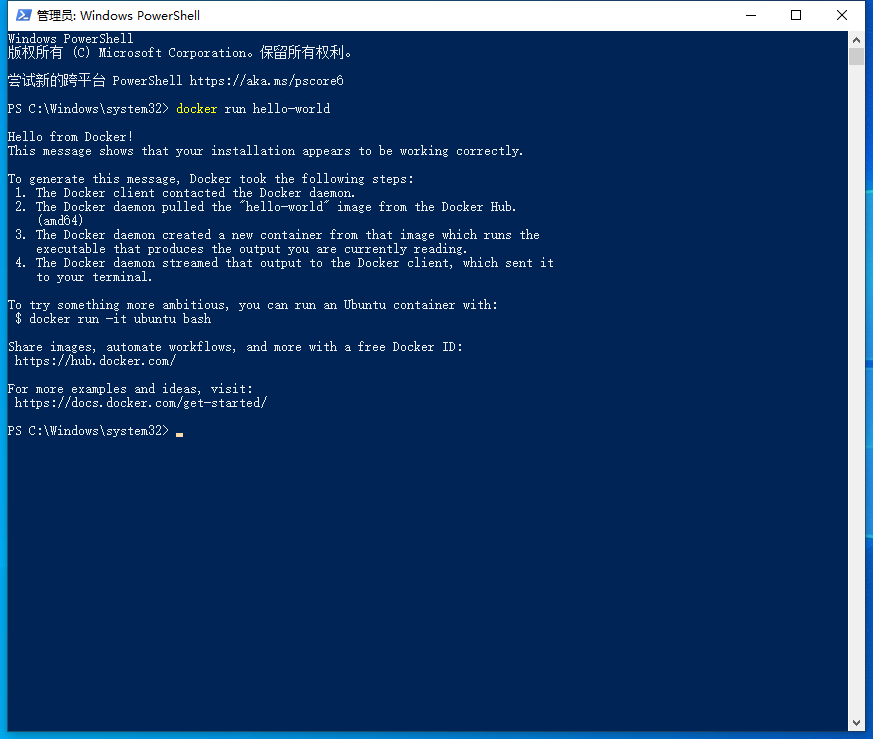

## **docker的介绍，安装及基本指令**

### **什么是docker？**

Docker 是一个开源的应用容器引擎，基于 Go 语言 并遵从 Apache2.0 协议开源。

Docker 可以让开发者打包他们的应用以及依赖包到一个轻量级、可移植的容器中，然后发布到任何流行的 Linux 机器上，也可以实现虚拟化。

容器是完全使用沙箱机制，相互之间不会有任何接口（类似 iPhone 的 app）,更重要的是容器性能开销极低。

`简单的说，使用docker，可以跳过环境搭建等等，可以快速上手licheepi-nano`

### **安装 docker**

- **linux（ubuntu）环境下安装：**

  使用官方安装脚本自动安装，安装命令如下：

  ``` shell
  curl -fsSL https://get.docker.com | bash -s docker --mirror Aliyun
  ```

  安装成功后，验证docker是否正确安装
  ``` shell
  docker run hello-world
  ```

- **win10 环境下安装：**

  > Docker 并非是一个通用的容器工具，它依赖于已存在并运行的 Linux 内核环境,
    Docker 实质上是在已经运行的 Linux 下制造了一个隔离的文件环境，因此它执行的效率几乎等同于所部署的 Linux 主机。
    在 Windows 上部署 Docker 的方法都是先安装一个虚拟机，并在安装 Linux 系统的的虚拟机中运行 Docker。

`Docker Desktop` 是 Docker 在 Windows 10 和 macOS 操作系统上的官方安装方式，这个方法依然属于先在虚拟机中安装 Linux 然后再安装 Docker 的方法。

  **安装步骤如下**：

  1. 安装 Docker Desktop ，[官方的下载地址](https://hub.docker.com/editions/community/docker-ce-desktop-windows)
  


  2. 安装成功后，会提示安装 wsl2 ，跳转到[链接](https://docs.microsoft.com/zh-cn/windows/wsl/install-win10#step-4---download-the-linux-kernel-update-package)，按照 `手动安装步骤` 完成前五个步骤即可

  3. 现在可以愉快的使用 docker 了，以用户管理员身份打开 `docker-desktop` ，使用图形界面操作。
  也可以打开 `PowerShell` ，使用命令行操作。(推荐)

  验证docker是否正确安装
  ``` shell
  docker run hello-world
  ```
  


### docker的基本指令

- 镜像操作
```shell
docker push [OPTIONS] NAME[:TAG]  # 获取镜像
docker images             # 列出镜像
docker search [OPTIONS] TERM    # 查找镜像
docker rmi [OPTIONS] IMAGE [IMAGE...] #删除镜像
```

- 容器操作
```shell
docker run [OPTIONS] IMAGE[:TAG|@DIGEST] [COMMAND] [ARG...] # 通过镜像启动一个新的容器
docker ps -a # 查看所有容器
docker docker start [OPTIONS] CONTAINER [CONTAINER...] # 启动停止的一个容器
docker stop [OPTIONS] CONTAINER [CONTAINER...] # 停止容器
docker rm [OPTIONS] CONTAINER [CONTAINER...] # 删除容器
```

- 仓库操作
```shell
docker login [OPTIONS] [SERVER] # 登录docker hub
docker logout [OPTIONS] [SERVER] # 退出docker hub
docker search [OPTIONS] TERM # 查找镜像
docker pull [OPTIONS] NAME[:TAG|@DIGEST] # 拉取镜像
docker commit [OPTIONS] CONTAINER [REPOSITORY[:TAG]] # 打包容器为镜像
docker push [OPTIONS] NAME[:TAG] # 推送镜像
```


