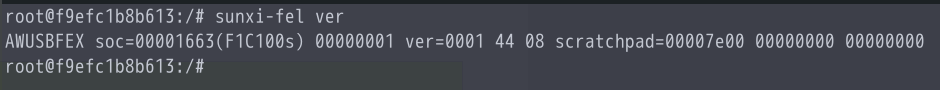
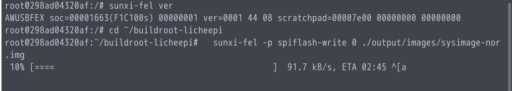
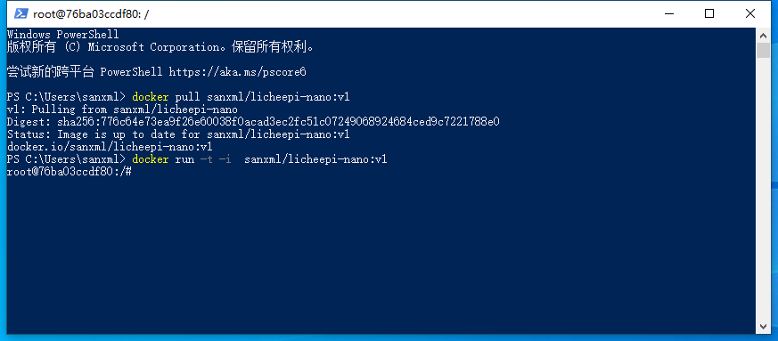
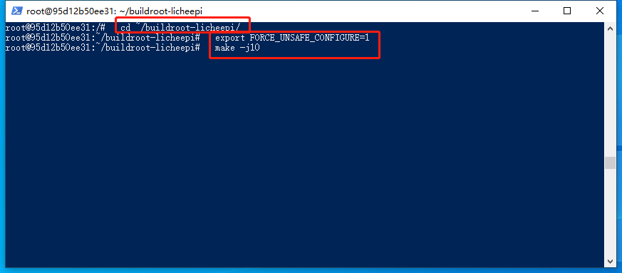
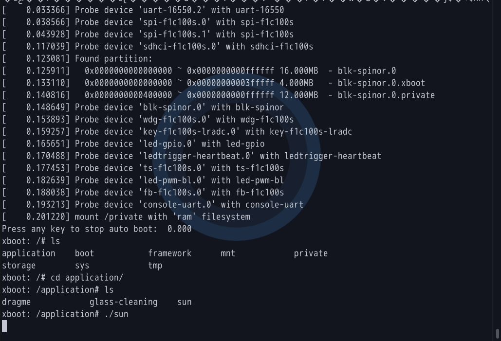
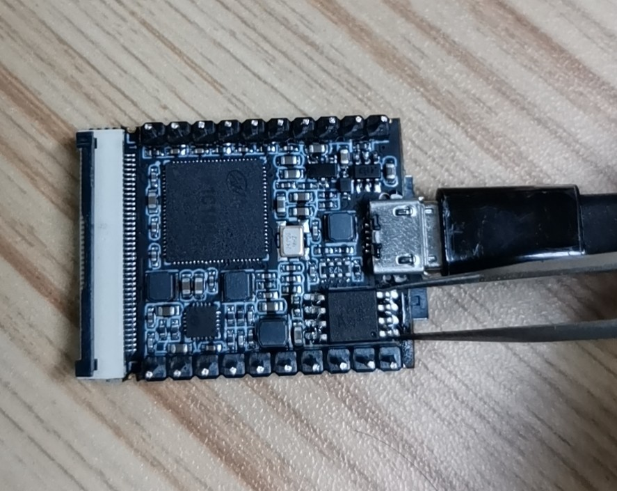

## **使用docker快速上手licheepi-nano**

### 1. 安装docker
  docker的介绍，安装及基本指令,具体查看 [文档](../docker的介绍，安装及基本指令.md)

### 2. linux环境下快速上手

- 获取licheepi-nano镜像，并将主机驱动共享到容器
  ```shell
  docker pull sanxml/lichee-nano # 获取镜像
  # 这里使用--privileged共享主机上的驱动程序，即可以直接通过 docker 使用 sunxi-tools 烧录镜像
  docker run -t -i --privileged -v /dev/bus/usb:/dev/bus/usb sanxml/lichee-nano  # 生成一个可执行的新容器
  ```

- 获取的镜像已经帮我们搭建好了编译环境,下面直接进行编译
  ``` shell
  cd ~/buildroot-licheepi/
  export FORCE_UNSAFE_CONFIGURE=1
  # make menuconfig 配置，这里默认适配了 4.3 寸 480X272 LCD
  make -j10
  ```

- 使用 sunxi-tools 烧录镜像

  编译好镜像后，镜像文件在 ` ~/buildroot-licheepi/output/images/ ` 文件夹下，
  其中，sysimage-nand.img、sysimage-nor.img，sysimage-sdcard.img，分别对应flash和tf卡的镜像

  下面是镜像的烧录，连接licheepi-nano后，验证是否进入fel模式
  ``` shell
  sunxi-fel ver
  ```
  

  烧录镜像文件
  ``` shell
  cd ~/buildroot-licheepi
  sunxi-fel -p spiflash-write 0 ./output/images/sysimage-nor.img
  ```
  

### 3. windows环境下快速上手

- 获取licheepi-nano镜像

  ``` shell
  docker pull sanxml/licheepi-nano:v1 # 获取镜像
  docker run -t -i  sanxml/licheepi-nano:v1  # 生成一个可执行的新容器
  ```
  

- 获取的镜像已经帮我们搭建好了编译环境,下面直接进行编译
  ``` shell
  cd ~/buildroot-licheepi/
  export FORCE_UNSAFE_CONFIGURE=1
  # make menuconfig 配置，这里默认适配了 4.3 寸 480X272 LCD
  make -j10
  ```
  

- 安装sunxi-tools烧录工具并烧录镜像文件

  待补充

### 4. 简单上手使用

  成功烧录程序后，需要进行系统调试

  Nano 的系统调试串口是 UART0 ，即板子丝印上的的 “U0：Tx Rx” 标识的两个引脚。

  使用usb转ttl模块，连接如下图所示：
  

  使用 `putty` 或者 `minicom` 等串口终端工具调试，默认登录账号为：root，密码为空


### 5. xboot

  XBOOT不仅仅是一款功能强大、可移植性强、代码复用率高的嵌入式系统bootloader，而且还是一款SOC片上系统应用软件执行引擎，无需复杂的操作系统，APP上电直接执行。

  不同于上面介绍所用的u-boot，xboot无需配置，下面介绍如何快速上手。

  安装好 docker 后，获取 xboot 镜像

  ``` shell
  docker pull sanxml/lichee-nano:xboot # 获取镜像
  docker run -t -i --privileged -v /dev/bus/usb:/dev/bus/usb sanxml/lichee-nano:xboot  # 生成一个可执行的新容器
  ```
  ``` shell
  sunxi-fel ver # 检验是否是否进入fel模式
  sunxi-fel -p spiflash-write 0 ~/xboot/output/xboot.bin # 烧录镜像
  ```

  连上usb转串口，打开串口终端工具
  

  ``` shell
  cd application
  ./sun # 运行例子，可以连上屏幕查看哦
  ```


### 报错及解决办法

1. 运行 make menuconfig 时，报错 `Unable to find the ncurses libraries or the required header files.`

  缺少依赖，使用 apt 安装依赖
  ``` shell
  apt install libncurses5-dev
  ```

2. 编译时，如果报错 `error: you should not run configure as root (set FORCE_UNSAFE_CONFIGURE=1 in environment to bypass this check)`

  解决办法：

  ``` shell
  export FORCE_UNSAFE_CONFIGURE=1
  ```

3. 编译python时，报错：error: unknown type name ‘uuid_t’？

  解决办法，修改报错的文件 xxx/Modules/_uuidmodule.c

  ``` c
  #include "Python.h"
  /* #ifdef HAVE_UUID_UUID_H */
  #include <uuid/uuid.h>
  /* #elif defined(HAVE_UUID_H)
  #include <uuid.h>
  #endif */
  ```

4. 烧录时，报错：ERROR: Allwinner USB FEL device not found!

  如果flash已经烧录过程序了，需要先短接1，4脚再上电，进入下载模式，如下所示
  